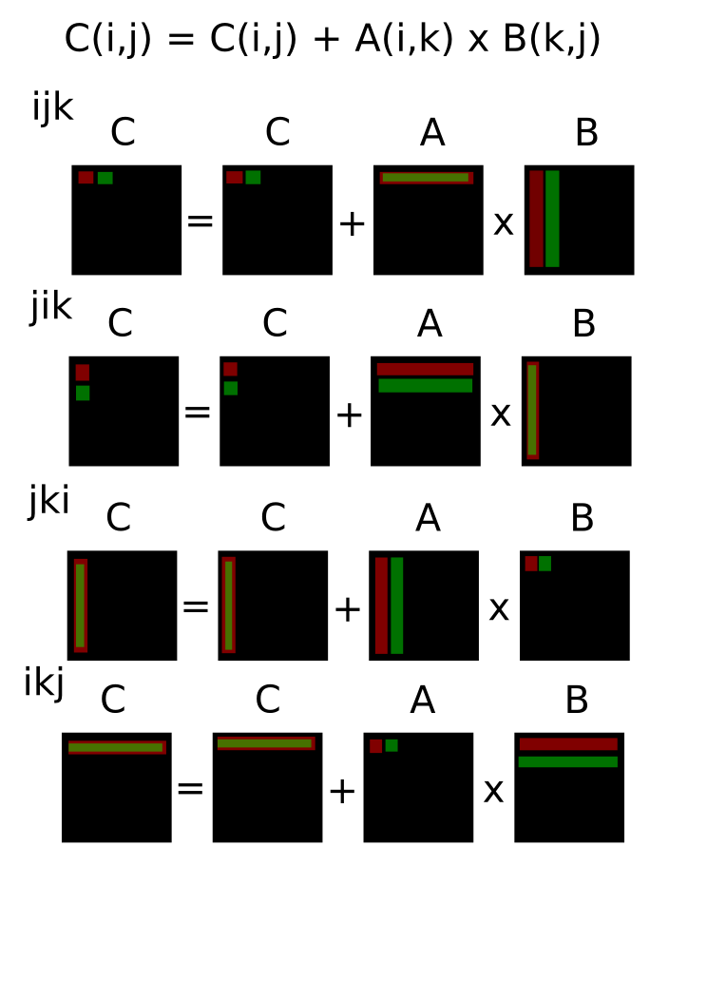
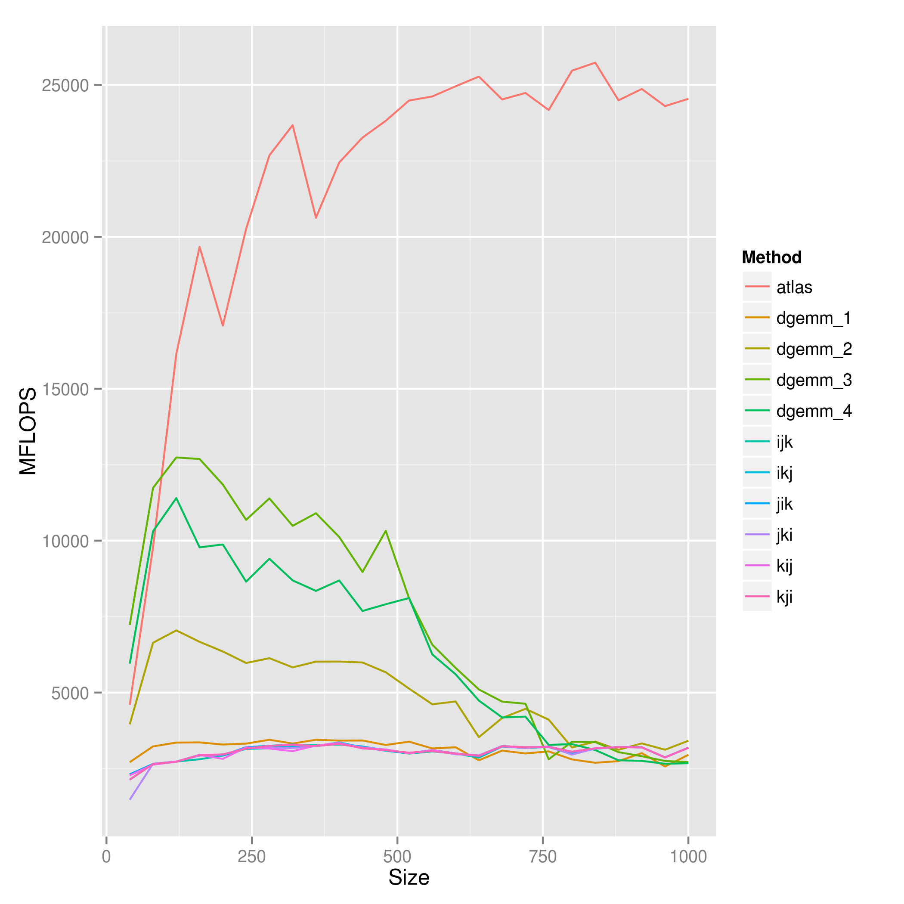
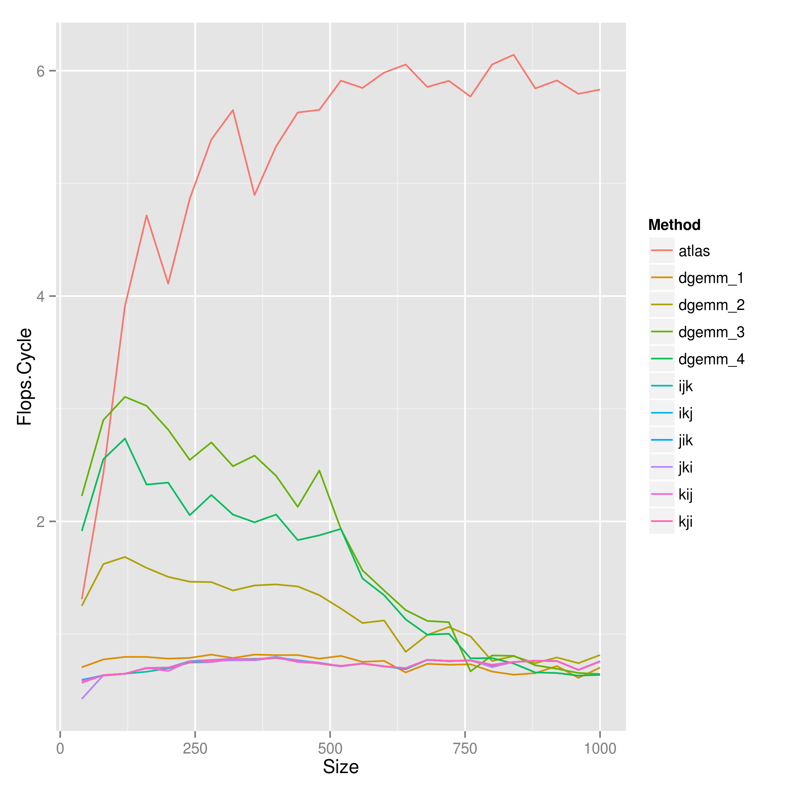
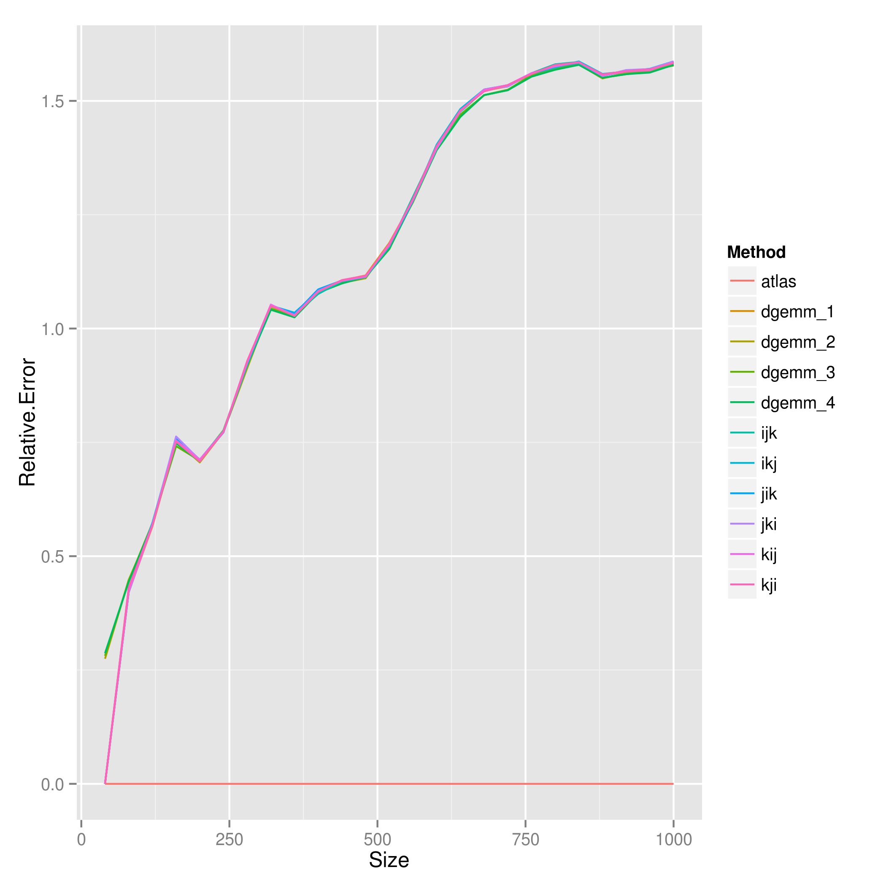

%Homework 10 - DGEMM optimization
%Chris Ostrouchov
%April 8, 2013

# Introduction

Matrix multiplication is a simple algorithm in computer science that demonstrates the importance of optimization. In BLAS this subroutine is called ?gemm and is often used as a benchmark of the performance of a CPU. For homework 10 we were assigned to analyze the difference between the ordering of loops in a naive gemm code shown bellow. Column ordered matrices were used for all calculations. While the assignment provided size matrices 10, 20 , 30, ... , 200, 250, ..., 500, different sizes were used in the code. This is due to my 4x4 blocking used for optimization. The sizes used were 40, 80, ..., 960, 1000. The cache was flushed before each run of a routine.

```Cpp
#define A(I,J) a[(I) + (J) * lda]
#define B(I,J) b[(I) + (J) * ldb]
#define C(I,J) c[(I) + (J) * ldc]

void ijk(int m, int n, int k, double *a, int lda,
                              double *b, int ldb,
							  double *c, int ldc) {
    int i,j,l
    for ( i=0; i<m; i++ )
        for ( j=0; j<n; j++ )
            for ( l=0; l<k; l++ )
                C(i,j) = C(i,j) + A(i,k) * B(k,j);
}
```

Afterwards our goal was to try and optimize our matrix multiply on the specific CPU our code was running on. The CPU used was an i5 3570K with SSE4.1/4.2 and AVX extensions. Having the AVX extensions enable us to compute on 4 doubles per cycle. Thus we would expect an optimal implementation to have similar performance. As a base comparison for the performance and correctness of each routine, the ATLAS 3.10.0 dgemm routine was used.

+----------+----------+
|Processor |i5        |
|          |3570K     |
+----------+----------+
|Clock     |3.4       |
|Rate      |GHz       |
+----------+----------+
|Cores     |4         |
+----------+----------+
|L1 Data   |4 x       |
|Cache     |32 KB     |
+----------+----------+
|L1        |4         |
|Latency   |cycles    |
+----------+----------+
|L2 Data   |4 x       |
|Cache     |256 KB    |
+----------+----------+
|L2        |11        |
|Latency   |cycles    |
+----------+----------+
|L3 Data   |6 MB      |
|Cache     |Shared    |
+----------+----------+
|L3        |28        |
|Latency   |cycles    |
+----------+----------+
|Extensions|SSE4.1/4.2|
|          |AVX       |
+----------+----------+

Several techniques were used for optimization. Blocking, registers, pointers, and AVX instructions enable significant performance gains. Several papers and example code must be mentioned as they were extremely beneficial:  
1.  __Anatomy of high-performance matrix multiplication__ by Kazushige Goto, Robert A. van de Geijn  
2.  __BLIS: A Framework for Rapid Instantiation of BLAS Functionality__ by Field G. Van Zee, Robert A. van de Geijn.  
3.  [Matrix Optimization](http://wiki.cs.utexas.edu/rvdg/HowToOptimizeGemm/)  

# Results/Discussion

Each of the methods used to solve the matrix multiplication are shown as a different colored line in each plot. The method "atlas" is the reference subroutine generated by atlas. The last Figure 4 show that error for each routine is normal. The deviation from 1.0 is due to the condition number of each random matrix. Thus each routine is correct.

I did not get my matrix multiplications to deviate (much) from each other still achieving about 0.75 flops per cycle! This can only be explained by the fact that gcc is somehow optimizing them out.

Since our matrix is column major we would expect the fastest algorithm that would take advantage of this column order. The data from papi is inconclusive because the compiler must have manipulated the for loops. However, this does not mean that we cannot determine which algorithm should be the fastest. Referring to Figure 1, I have made images that help describe the progression of the algorithm with different looping structures. I have NOT included the {kij and kji} implementations because they are the __slowest__ because they do not have any reuse of the C matrix which is essential for a fast algorithm. This is because in every algorithm C is the most written to array. "jik" and "ikj" can be disqualified because of how in A and B the elements are accessed by rows. This leaves just the "ijk" and "jki" algorithms. __jki__ ultimately is the faster of the two because of the reuse the C array. To verify this answer that jki is the best for a column based indexing array see the reference dgemm blas implementation [BLAS dgemm](http://www.netlib.org/clapack/cblas/dgemm.c).

Part 2 of the homework assignment required us to optimize the gemm implementation. I spent about two days working on improving my algorithm. In this process, I have learned some of the "art" of optimization. Each optimization can be found in the file __src/gemm_optimization.c__. The first improvement in my code was treating the matrices as blocks in the jki algorithm. Each block had a size of 4x4 (This size was chosen due to knowledge of the Intel AVX capabilities of my architecture). The blocking algorithm called dgemm_1 in Figures 2-4 show that a small improvement was achieved. Next, I unrolled the loop making heavy use of Registers in C (I made many more registers request that there were available). Explicitly telling the compiler to use registers creates around a __2X__ improvement and we are not achieving around 1.5 flops/cycle (dgemm_2). Finally dgemm_3 and dgemm_4 take advantage of the vector extensions available in the new Ivy Bridge chips from Intel. We can see that by using the Intel intrinsic I achieve __3 flops/cycle and 13GFlops__! Obviously atlas achieves much better results. These differences are due to proper block size and complete use of the AVX extensions.  










