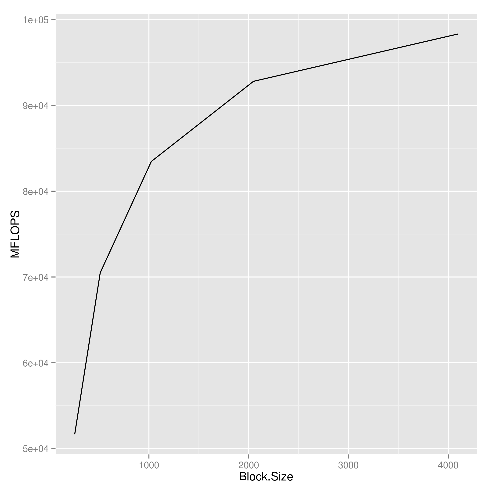
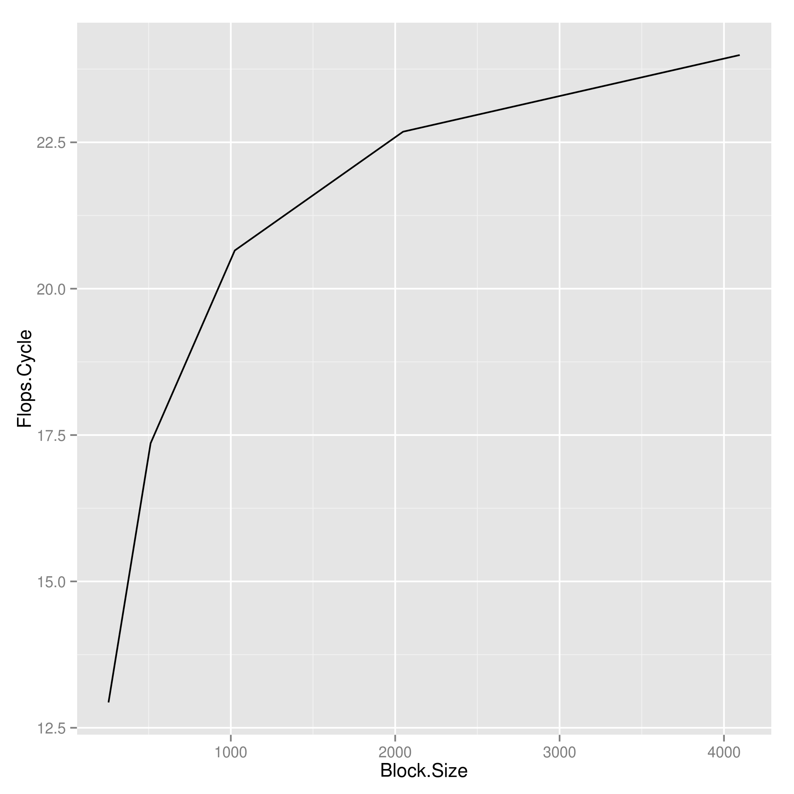

%Homework 11 - MPI pgemm
%Chris Ostrouchov
%April 23, 2013

# Introduction

For homework 10 we were asked to implement 4 parts. Each building on more and more of using the MPI library. Simply type `make test` to create and test the execuble. To create the plots seen in this pdf run `make plot`. See the README for further information on the source directory structure. The code in `src` is broken into 5 tests each representing a part of the homework. All test were performed on an i5 3570K Ivy Bridge processor with specs seen in the table below. Each test is verified using assert statements. For the extra credit I looked at the effect of blocking size on the computation time of the matrix. Assuming that you are using a bash shell you will recieve special colored output when you run the executable. This allowed for easy debugging and nice matrix verification. I construct only the local view of each matrix using a function passed by a pointer `f[a-c](i, j)`. This allowed for very easy testing on tridiagonal, bidiagonal, upper triangular, lower triangular, and random matricies. Each was verified that it was correct. For part 4 I used the PUMMA method for matrix multiplication. I used ATLAS for the local matrix computations.

+----------+----------+
|Processor |i5        |
|          |3570K     |
+----------+----------+
|Clock     |3.4       |
|Rate      |GHz       |
+----------+----------+
|Cores     |4         |
+----------+----------+
|L1 Data   |4 x       |
|Cache     |32 KB     |
+----------+----------+
|L1        |4         |
|Latency   |cycles    |
+----------+----------+
|L2 Data   |4 x       |
|Cache     |256 KB    |
+----------+----------+
|L2        |11        |
|Latency   |cycles    |
+----------+----------+
|L3 Data   |6 MB      |
|Cache     |Shared    |
+----------+----------+
|L3        |28        |
|Latency   |cycles    |
+----------+----------+
|Extensions|SSE4.1/4.2|
|          |AVX       |
+----------+----------+

# Results/Discussion

Looking at the Figures below it is very apparent that the blocking size has a large effect on the speed on the parallel matrix multiply. I only tested them on a 2x2 processor grid. Sadly I was unable to test larger matrix sizes due to the memory on my machine. We can infer that the optimal blocking size is around 4096x4096 due to the curvature of the line at the point (yes I know this statement is very qualitative).

