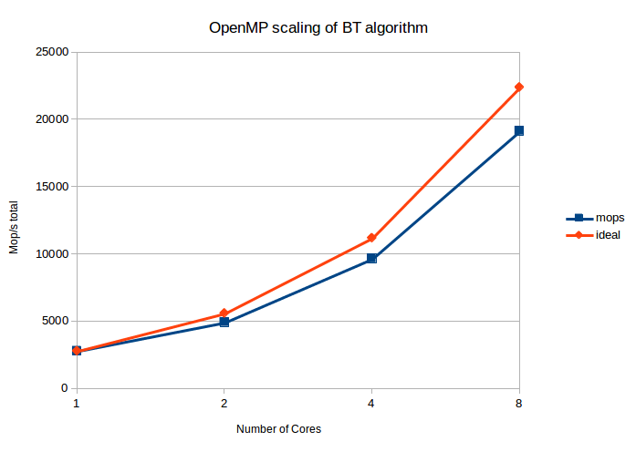

# Problem 1 - Compute rates

For my analysis I used the hpctoolkit compiled with the ability to use the PAPI toolkit. I compiled hpctoolkit and papi for each cluster I tried. I was disappointed that on all the machines I tried were unable to supply the PAPI_LST_INS event. Thus I was unable to collect the statistic LPC. I tried the machine hopper and edison clusters at NERSC along with my own machine/cluster. All metrics were calculated using the exclusive statistics. Results and hpctoolkit databases can be found for each run in the test folder. FPC was calculated as exclusive Floating point instructions divided by total number of cycles. IPC was calculated as exclusive instructions divided by total number of cycles. A sampling rate of 100000 was used for each event PAPI_FP_INS, PAPI_TOT_INS, PAPI_LST_INS, PAPI_TOT_CYC. To look at the results closer consult the directory `test/1result/1/`. Each run was done using a bash script found in `test/`. Results are automatically generated in [123]result.

## Papi_component_avail  
Available components and hardware information.
--------------------------------------------------------------------------------
PAPI Version             : 5.3.0.0  
Vendor string and code   : GenuineIntel (1)  
Model string and code    : Intel(R) Core(TM) i5-3570K CPU @ 3.40GHz (58)  
CPU Revision             : 9.000000  
CPUID Info               : Family: 6  Model: 58  Stepping: 9  
CPU Max Megahertz        : 3401  
CPU Min Megahertz        : 1600  
Hdw Threads per core     : 1  
Cores per Socket         : 4  
Sockets                  : 1  
NUMA Nodes               : 1  
CPUs per Node            : 4  
Total CPUs               : 4  
Running in a VM          : no  
Number Hardware Counters : 11  
Max Multiplex Counters   : 64  
--------------------------------------------------------------------------------  

Compiled-in components:  
Name:   perf_event              Linux perf_event CPU counters  
Name:   perf_event_uncore       Linux perf_event CPU uncore and northbridge  
   \-> Disabled: Insufficient permissions for uncore access.  Set /proc/sys/kernel/perf_event_paranoid to 0 or run as root.  

Active components:  
Name:   perf_event              Linux perf_event CPU counters  
                                Native: 161, Preset: 50, Counters: 11  

--------------------------------------------------------------------------------  
component.c                             PASSED  

## Results
Below you will see the top 6 most time consuming routines 

+-----------+-----+-----+-------+
|Function   |FPC  |IPC  |Total  |
|           |     |     |Cycles |
+-----------+-----+-----+-------+
|binvcrhs   |0.812|2.4  |2.52e11|
+-----------+-----+-----+-------+
|y_solve_   |0.459|1.22 |4.77e10|
+-----------+-----+-----+-------+
|z_solve_   |0.464|1.3  |4.53e10|
+-----------+-----+-----+-------+
|x_solve_   |0.651|1.77 |3.25e10|
+-----------+-----+-----+-------+
|compute_rhs|0.519|1.53 |3.03e10|
+-----------+-----+-----+-------+
|matmul_sub |0.86 |2.55 |2.93e10|
+-----------+-----+-----+-------+

# Problem 2 - Scaling Efficiency

+------+--------+
|Number|Mop/s   |
|Cores |total   |
+------+--------+
|1     |2799.34 |
+------+--------+
|2     |4925.71 |
+------+--------+
|4     |9653.68 |
+------+--------+
|8     |19147.88|
+------+--------+

Not surprisingly the algorithms does not perfectly scale with the number of openmp cores used. The performace decreases as the number of cores increses.

# Problem 3 - Differential Analysis

Here are results for the total number of cycles for the whole program and select cycles. See /test/3result/ for detailed data on the runs.

+--------+-------+
|Function|Total  |
|        |Cycles |
+--------+-------+
|2 Cores |       |
+--------+-------+
|Total   |1.83e11|
+--------+-------+
|binvcrhs|4.48e10|
+--------+-------+
|z_solve_|2.87e10|
+--------+-------+
|4 Cores |       |
+--------+-------+
|Total   |1.83e11|
+--------+-------+
|binvcrhs|4.49e10|
+--------+-------+
|z_solve_|2.87e10|
+--------+-------+
|y_solve |2.80e10|
+--------+-------+
