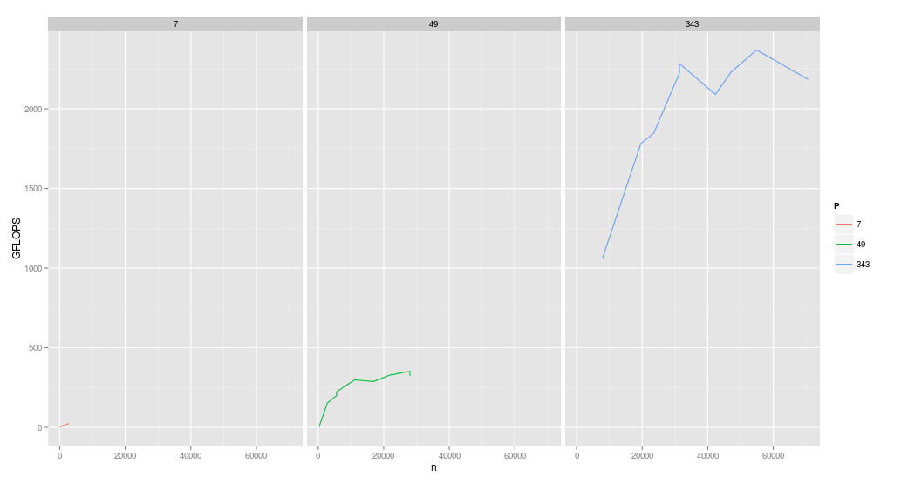
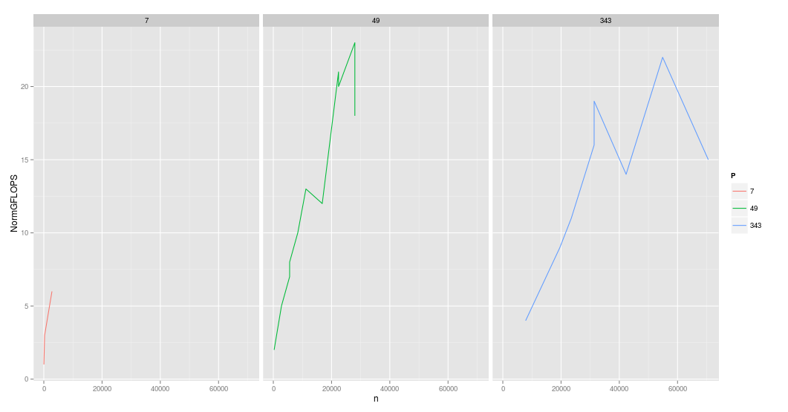
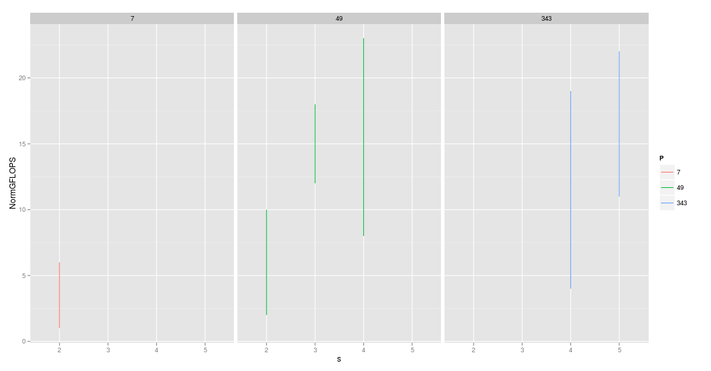

% Communication Optimal Parallel Strassen Multiplication
% Chris Ostrouchov
% 5/03/2013

# Introduction

Matrix Multiplication is one of the most studied and researched problems in High Performance Computing. It is unique in that a simple version can be written in 4 lines of code.  However, it's performance will be substantially less, (20X) that from a well written algorithm for a single core. For these serial algorithms to be fast they must take advantage of memory reuse and special vector operations (AVX) available from Intel. It is well known that matrix multiplication is an $O(2N^{3})$ operation with 8 multiplications and 4 additions.

```
for (int i=0; i<m; i++)
    for (int j=0; j<n; j++)
	    for (int k=0; k<l; k++)
            C[m,n] = C[m,n] + A[m,k]*B[k,n];
```

Matrix multiplication is found in BLAS Level 3 as {s,d,z,c}gemm. However there are severe limitations to implementations of matrix multiplication on a single chip as you are limited to dense matrices in size around 1000-10000. Parallel matrix multiplication solves this problem but also introduces problems of its own that had little effect in serial programming. Some well known and popular algorithms are the (Scalable Universal Matrix Multiplication Algorithm) SUMMA and PUMMA. Both of these algorithms send broadcasts throughout either a whole row or column on each iteration. This process becomes the dominant bottleneck in these algorithms. Thus one can image that a better algorithm that did not require large communication groups and did not send as large messages would be optimal.

## Strassen's Algorithm
Volker Strassen published in 1969 his algorithm for the improvement in matrix multiplication with respect to the number of multiplications. He reduced the number of multiplications to 7 and additions from 4 to 14. While there is a larger increase to additions and subtractions this only affects the $O(N^{2}$ term. Strassens algorithm reduced the matrix multiplication complexity to $O(N^{2.83})$. In the section bellow the algorithm is described.

```
T_0 = A_11                        S_0 = B_11       
T_1 = A_12                        S_1 = B_21       
T_2 = A_21 + A_22                 S_2 = B_12 - B_11
T_3 = T_2  - A_11                 S_3 = B_22 - S_2 
T_4 = A_11 - A_21                 S_4 = B_22 - B_12
T_5 = A_12 - T_3                  S_5 = B_22       
T_6 = A_22                        S_6 = S_3  - B_21
				               
Q_0 = T_0 * S_0                   U_1  = Q_0 + Q_3
Q_1 = T_1 * S_1                   U_2  = U_1 + Q_4
Q_2 = T_2 * S_2                   U_3  = U_1 + Q_2
Q_3 = T_3 * S_3                   C_11 = Q_0 + Q_1
Q_4 = T_4 * S_4                   C_12 = U_3 + Q_5
Q_5 = T_5 * S_5                   C_21 = U_2 - Q_6
Q_6 = T_6 * S_6                   C_22 = U_2 + Q_2
```

While this algorithm can be used on simple two by two matrices, it largest advantage is that you can recursively use strassen's algorithm to reduce the overall number of operations. One must ask themselves then why has strassen's algorithm has not already been used been used in HPC. In fact in the Linpack benchmark Strassen's algorithm is not allowed to be used.

> "we do not allow Strassen's Algorithm to be used for the TOP500 reporting" - [Top 500](http://www.netlib.org/utk/people/JackDongarra/faq-linpack.html#_Can_I_use)

The main issue regarding Strassens Algorithm is stability and the relative error. Generally error can be seen to be 10-100x that of standard matrix multiplication [2]. However, Ballard et al. note that this stability is often over exaggerated and with a proper recursive cutoff this error can be minimized. Also the matrix can be preconditioned before hand (an $O(n^{2})$ operation with a diagonal matrix.

Another issue regarding why strassen's algorithm has not been adopted. Much like the briefly mentioned classical parallel matrix multiplications mentioned before, current parallel strassen algorithm's suffer from the communication bottleneck. The algorithm to be proposed must be able overcome this issue.

## Motivation for Minimizing Communication

I have emphasized many time that minimizing is the key to having an eficient parallel algorithm. There are several reasons for this. Most importantly bandwidth and latency for these types of memory accesses are improving the slowest of all the other factors in computer architecture. Additionally the power used for network transmissions is orders of magnitude higher than that of a local memory access. As we move toward Exaflop computing these issues will be magnified. And theoretical computing models implemented in [2] show that (CAPS) will perform better versus classical implementations as the number of nodes increases.

# Communication Optimal Strassen's Algorithm (CAPS)

Originally, I was just going to implement a naive parallel Strassen Algorithm. However, as soon as I read Ballerd, et al. "Communication-Optimal Parallel Algorithm for Strassen's Matrix Multiplication" I became very fascinated in implementing this origami like approach to matrix multiplication. Ballard et al. stated their work was motivated by "observing the asymptotic gap between the communication costs of existing parallel Strassen-based algorithms and the communication lower bound". Much like many of the classical algorithms, this algorithm uses up as much local memory as possible for each processor. Thus it it interesting that the performance of this algorithm is limited by the size of local memory __not__ the speed. 

## Algorithm

__Discretion Advised__ (I would read [1] for a much better explanation than I could give) thus I will only try to explain the parts of the algorithm that I do not think were covered well in the paper. Strassen's Algorithm can be broken into two stages BFS (Breadth First Search) and DFS (Depth First Search). In a perfect world with a machine that has unlimited memory only a BFS step would be followed. However, due to memory limitations a minimal number of DFS steps must be taken in combination with BFS. A BFS is characterized by 4 features as opposed to DFS. The Matrix A is split into 7 problems as defined by strassens algorithm and handled by $P/7$ processors. This step requires $7/4$ as much memory as the DFS step but reduces the required communication and takes an all to all communication between 7 processors. Most of the major drawbacks for BFS is in the increase in memory required. DFS does __not__ reduce the number of processors working on the communication but only required 1/4 as much memory. In turn this increases the bandwidth by a factor of 7/4.

One of the trickiest parts of the CAPS algorithm is the communication patterns between the processors in the BFS step. I spent 2 days trying to understand the exact meaning of "redistribute these 14 matrices so that the 7 pairs of matrices $(S_{i}, T_{i})$ exist on disjoint sets of $P/7$ processors. It turns out that the communication is not as simple as they make the statement sound. These disjoint sets must be mapped to the same processor in each recursion.

I realized the full power of MPI when writing the communication patterns in the DFS and BFS steps. As I mentioned previously, at each BFS step the number of processors working on a matrix part is P/7. Thus the communicator can be remapped such that only the processors working on the same problem are talking to each other. To create these new communicators I used the very powerful `MPI_Comm_split()`. The CAPS algorithm had surprisingly only one to make to redistribute the parts `MPI_Alltoall()`. I also came to appreciate that `MPI_Alltoall()` is its own inverse! After each processor is its own communication group it performs a local matrix multiply. For local matrix multiplication I have used the MKL dgemm routine.

## Theoretical Performace

+------------+----------------------+----------------------------+------------------------+
|            | FLOPS                |Bandwidth                   |Latency                 |
|            |                      |                            |                        |
+------------+----------------------+----------------------------+------------------------+
|Clasical    |$\frac{n^{3}}{P}$     | $\frac{n^{2}}{P^{1/2}}$    |$\frac{n^{3}}{PM^{1/2}}$|
|Lower Bound |                      |                            |                        |
+------------+----------------------+----------------------------+------------------------+
|CAPS        | $\frac{n^{2.81}}{P}$ | $\frac{n^{2}}{P^{2/2.81}}$ | $\log{P}$              |
+------------+----------------------+----------------------------+------------------------+

We can see from the theoretical performance numbers that CAPS should perform better than classical matrix multiplication for all sizes of matrices! Previously with other Strassen Parallel implementations there was a minimum size matrix for Strassen to overcome. Just like the Strassen's Algorithm CAPS does have stability issues. 

# Results/Discussion

All on my codes were run on a Cray XT4 at hopper on the NERSC clusters. I successfully ran the code of varying processors {7, 49, 343, and 2401} with matrix dimensions between $80 - 80000$. Coincidentally the paper [1] that I have derived my algorithm from ran their test on the exact same machine. Thus I will be comparing with results found in the paper. I had a rather informal way of verifying the correctness of my code since I was unable to get scalapack to run with my code. I considered each block to be one contiguous array of memory. To verify the corectness of my code I would input simple matrices for A and B such as upper/lower triangular, identity, all ones, and hand checked random matrices. The difficulty of using ScaLAPACK originated from how I interpreted the local view of the block cyclic layout. My view differs from ScaLAPACK in that the local view of the matrix is simply a column major array (with "imposed" block sizes). Looking back I can see how this would have simplified my code and even have made it run faster. However, it was not until too late that I realized this mistake.

Additional performance bottlenecks that I imposed on myself is the excessive use of memcpy to remap the array after each communication. Only one `MPI_Alltoall()` call is made in each communication. I could have avoided remapping the local memory if I had made multiple mpi calls (thus there is a tradeoff). For the timing of my code I have used the PAPI toolkit that was heavily used in CS 594. Since the timing of the multiplications were in seconds there really was not much benefit to using PAPI.

Figure 1 show the GFLOPS performance of my code versus the dimension of the matrix. It is very obvious that weird matrix dimensions are chosen. This is due to the parameters that I can manipulate and the restrictions of the algorithm. The processor count is the major restriction. We can see that the algorithm reaches a peak performance with 343 processors at 2.5 Teraflops. I found this accomplishment very satisfying as I have not written an algorithm that has achieved such performance before. However, we can see from Figure 2 that the first figure is deceiving. 



Once the FLOPS are divided by the number of nodes we can easily see that all processor sizes are performing at the same effective GFLOPS for each matrix dimension. I have included Figure 3 to show how sensitive the performance was to the parameters that I provided. The s parameters determines the number of BFS and DFS steps allowed (but is also affected by the block size and number of processors). Thus for my testing I resorted to guessing parameters that would create a spread of matrix sizes. 





# Conclusion

The CAPS algorithm show a promising future with the trend towards Exaflop computing. Aside from stability CAPS show superior performance in FLOPS, Bandwidth, and Latency. All of which are very important to Matrix Multiplication. Debugging Strassen's Algorithm is a nightmare as it does not follow __any__ of your intuition as to what should be in each local matrix. The proposed communication pattern along with memory usage is easily applicable to other algorithms. I can easily imagine how this same method could be mapped to normal matrix multiplication to apply to processors of size $8^{k}$.

# Reference
(1) Grey Ballard, James Demmel, Olga Holtz, Benjamin Lipshitz, Oded Schwartz, __Communication-Optimal Parallel Algorithm for Strassen's Matrix Multiplication__, *2012*
(2) Grey Ballard, James Demmel, Olga Holtz, Benjamin Lipshitz, Oded Schwartz, __Communication-Avoiding Parallel Strassen: Implementation and Performace__, *2012*
(3) Strassen's Algorithm (http://en.wikipedia.org/wiki/Strassen_algorithm)
